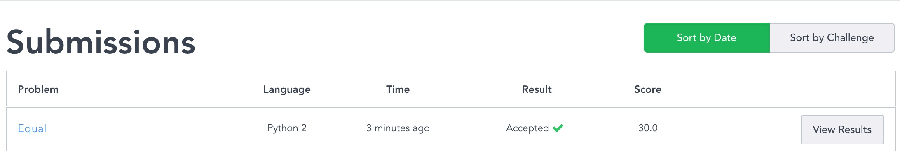
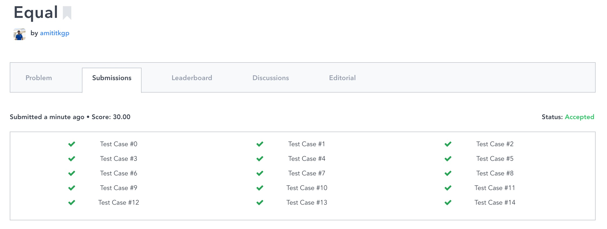
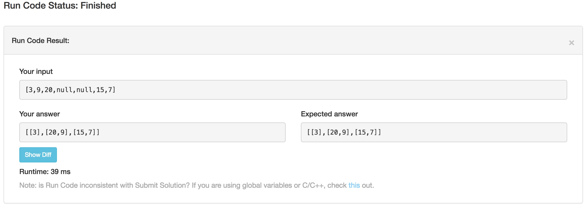

# INFO 298: Applied Algorithms Overview

The goal of this group study is to be able to program solutions to hard 
algorithmic problems.
 * Solve two algorithm problems each week and share.
 * Code Review as a group on the assignment.
 * Do one white boarding session each week on solving problems.
 * Periodically enter coding challenges online to assess our capabilities.

---------------------------------------
## Table of Content
- [**Syllabus**](#syllabus)
- [**Tests Status**](#tests-status)
    - [***Week One***](#week-one)
    - [***Week Two***](#week-two)
    - [***Week Three***](#week-three)
    - [***Week Four***](#week-four)
- [**Todo**](#todo)

---------------------------------------
## Syllabus
 1. Dynamic Programming
    * subsequence, palindrome variations
 2. Dynamic Programming
    * Edit distance variations, harder problems
 3. Data Structure review and white boarding sessions
 4. Greedy Algorithms
 5. Searching
 6. Coding Challenge Competitions
 7. Sorting
 8. Divide and Conquer
 9. Randomized Algorithms
 10. Coding Challenge Competitions
 11. Graph Algorithms
    * BFS, DFS, Toposort, Cycle, MST variations
 12. Graph Algorithms
    * Shortest path, connectivity, max flow, and hard problems
 13. Special Topics (challenging topics or outside speaker)
 14. Graph Algorithms
 15. NP Complete - approximations
 
---------------------------------------
## Tests Status

### Week One

### Week Two

[Euqal](https://www.hackerrank.com/challenges/equal)

[Fibonacci Modified](https://www.hackerrank.com/challenges/fibonacci-modified)

### Week Three
[Binary Tree Zigzag Level Order Traversal](https://leetcode.com/problems/binary-tree-zigzag-level-order-traversal/?tab=Description)

### Week Four
[Find Bottom Left Tree Value](https://leetcode.com/problems/find-bottom-left-tree-value/?tab=Description)

[None Overlapping Intervals](https://leetcode.com/problems/non-overlapping-intervals/?tab=Description)

---------------------------------------
## Todo
